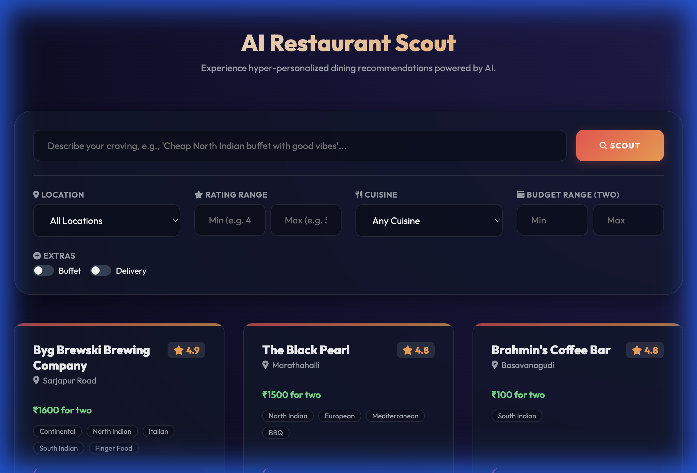
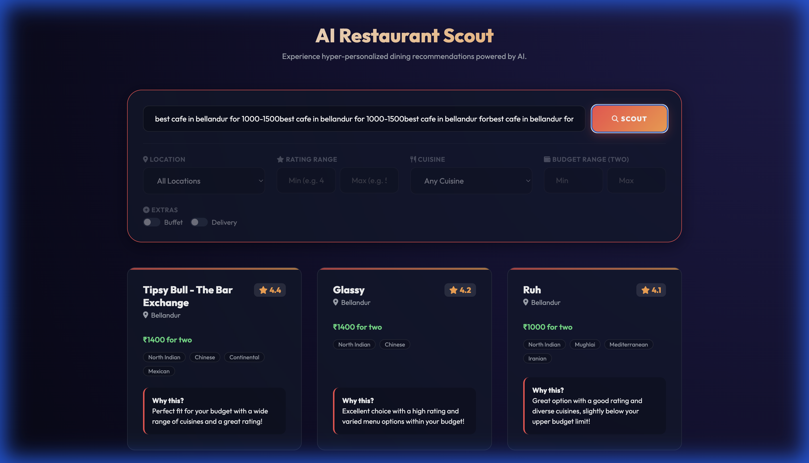

# AI Restaurant Scout 🕵️‍♂️🍴

[](https://nextleap-ai-project-1.vercel.app/)
[](https://github.com/manishkumar98/nextleap-ai-project-1)

Experience hyper-personalized dining recommendations powered by Groq LLM and the Zomato dataset.


## ✨ Features

- **Prompt-Based Search**: Describe your craving (e.g., *"Best cafe in Bellandur for 1000-1500"*) and let the AI find the perfect spot.
- **Filter-Based Search**: Use structured filters for Location, Cuisine, Rating, and Budget.
- **AI-Generated Reasons**: Every recommendation comes with a catchy explanation of why it fits your preference.
- **Live UI**: A modern, responsive web interface with visual feedback for different search modes.
- **Safe Mode**: Automatic visual dimming of filters when a text prompt is entered to ensure search clarity.

## 🖼️ UI Preview


*Modern Glassmorphism UI with natural language search*


*Accurate budget-filtered results powered by Groq LLM*

## 🏗️ Architecture

The project is organized into clear phases:
1.  **Data Ingestion**: Loading and cleaning Zomato data into SQLite.
2.  **Feature Engineering**: Precomputing popularity scores and categorical flags.
3.  **LLM Orchestration**: Using **Groq LLM** to parse natural language and re-rank results.
4.  **Retrieval**: Efficient SQL-based filtering with heuristic fallbacks.
5.  **API Layer**: FastAPI backend serving both the REST API and the static frontend.

## 🚀 Getting Started

### Prerequisites

- Python 3.9+
- A Groq API Key (stored in `.env`)

### Installation

1.  **Clone the repository**:
    ```bash
    git clone https://github.com/manishkumar98/nextleap-ai-project-1.git
    cd nextleap-ai-project-1
    ```

2.  **Set up the environment**:
    ```bash
    python3 -m venv .venv
    source .venv/bin/activate
    pip install -r requirements.txt
    ```

3.  **Configure API Keys**:
    Create a `.env` file in the root directory:
    ```env
    GROQ_API_KEY=your_actual_key_here
    USE_LLM_BY_DEFAULT=1
    ```

### Running the Project

1.  **Start the Backend**:
    ```bash
    python -m phase5_api.main
    ```

2.  **Access the UI**:
    Open your browser and navigate to:
    [http://localhost:8001/](http://localhost:8001/)

## 🧪 Testing

Run the test suite using pytest:
```bash
pytest tests/
```

## 🌐 Deployment Guide

This project is designed for a dual-deployment strategy:
1.  **Backend Logic & AI Dashboard**: Hosted on **Streamlit Cloud**.
2.  **Modern UI Frontend**: Hosted on **Vercel**.

### 1. Deploying Backend (logic) on Streamlit Cloud
1.  **Push to GitHub**: Ensure the latest code is on your main branch.
2.  **Connect to Streamlit**:
    -   Go to [share.streamlit.io](https://share.streamlit.io/).
    -   Click **"New app"** and select your repository (`nextleap-ai-project-1`).
    -   Set **Main file path** to `streamlit_app.py`.
3.  **Configure Secrets**:
    -   In the app settings, go to **Secrets** and add:
        ```toml
        GROQ_API_KEY = "your_groq_api_key_here"
        USE_LLM_BY_DEFAULT = "1"
        ```
    -   Streamlit Cloud automatically handles the `zomato_restaurants.db` (it is committed to the repo).

### 2. Deploying Frontend on Vercel
1.  **Push to GitHub**: (Already done).
2.  **Connect to Vercel**:
    -   Go to [Vercel Dashboard](https://vercel.com/dashboard).
    -   Click **"Add New"** -> **"Project"**.
    -   Import your repository.
3.  **Configure Environment Variables**:
    -   Go to Settings -> Environment Variables.
    -   Add `GROQ_API_KEY` (required for the FastAPI backend running on Vercel).
4.  **Deploy**: Vercel will use the `vercel.json` to automatically configure the static frontend and the Python serverless functions.


## 🛠️ Built With


- **Backend**: FastAPI, SQLAlchemy, Pydantic
- **AI**: Groq LLM (Llama 3)
- **Frontend**: Vanilla HTML5, CSS3 (Glassmorphism), JavaScript (ES6+)
- **Data**: Hugging Face Zomato Dataset
